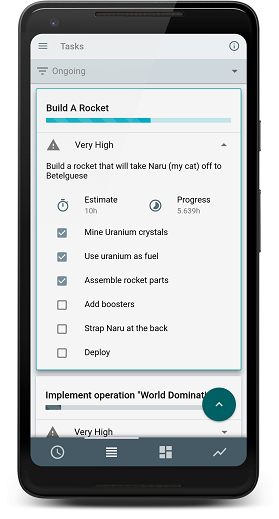
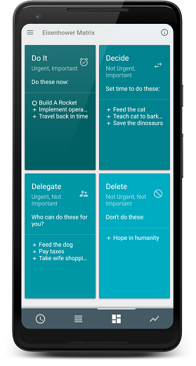
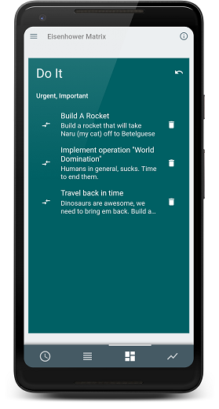
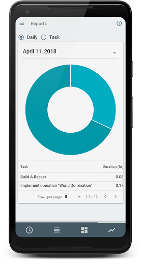
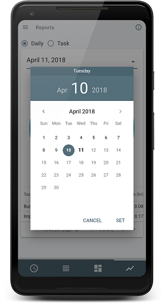
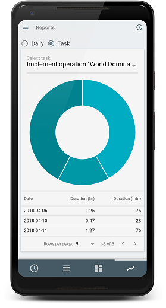

From the greek word “_chronos_" which means “_time_", and the latin “_curos_", which means “_to attend_", [Chronocross](https://play.google.com/store/apps/details?id=org.yevlabs.chronocross) is a Todo app that integrates other productivity techniques: The Pomodoro Technique and Eisenhower Matrix, into one cohesive workflow.

In a nutshell, Chronocross is really just a simple tool that I built to complement my workflow. I'm a huge productivity geek. I was hooked on crossing things off a list. I use [Cirillo's Pomodoro Technique](https://francescocirillo.com/pages/pomodoro-technique) to manage procrastination and maintain my focus. 

> The Pomodoro Technique&reg; is a time management method that uses a timer to break down your work into intervals, traditionally 25 minutes in length separated by short breaks. &mdash; [Wikipedia](https://en.wikipedia.org/wiki/Pomodoro_Technique)

Coupled with another productivity technique, [Eisenhower Matrix](http://eisenhower-matrix.com/) to help me prioritize which task should be worked on first thing in the morning and which should be last. My every working day felt like total bliss.

Eventually, moving between a todo app, a separate Pomodoro app, and a spreadsheet for my Eisenhower box felt lacking. It felt like it was begging me to integrate them all together into one cohesive app. At this point, I couldn’t really call myself a software developer if I didn’t immediately answer to the calling.

Originally, **Chronocross** was built using Angular. I was learning Angular back then and building an app using it seems like a good practice. But I just did not want to make another web app, because I giving myself a chance to procrastinate by switching and fooling around on other sites would drop my productivity. I decided to use Electron and develop it as a desktop application.

This sounded good at the time, but learning Angular and Electron along with my day-job made it really difficult to accomplish. I was working as a Java developer back then and this was my first time coming back to front-end after the whole JavaScript revolution. I learned the basics: HTML, CSS, JQuery and JavaScript back at the university. But I was in for a surprise. Configuring Electron to work with Angular was a nightmare to my unacquainted mind. Modify tsconfig? and Webpack? Loaders? Install NPM? What? Javascript can access the I/O now? Nodejs?

I did eventually manage to make it work (somehow). It took me a really long time and countless frustrations to do it; I almost dropped it to use Java and Swing and not bother learning something new that year. Halfway through my feature list I ended up shelving my little pet project.

Almost a year later, I was working at a different company as a Full-Stack Engineer, whatever that means (I think it means: I know Java and a little bit of HTML), using Angular in the front-end. I started to get that itch of wanting to learn new stuff again. I found myself at the doorsteps of the Vue ecosystem. I knew about Vue even back when I was first learning Angular but since Angular was the company’s choice of framework, I just shrugged it off. IMHO, Vue. Is. Pretty. Freaking. Awesome. The experience was love-at-first-vue-instance.

##### Quasar Framework
After porting my previous Angular portfolio website to Vue, I ventured farther in the Vue ecosystem's doorsteps and found myself along the valleys of Quasar Framework. I read the docs. And. It. Was. Just. Soooo. good.

Quasar is a framework that lets you build responsive Single-Page Apps, Server-side Rendered apps, Progressive Web Apps, Hybrid Mobile apps and Electron apps, **all using the same codebase**. Not only that it has a built-in UI library too that comes with Material and IOS theme. This is like a dream. All you ever need to worry about is build your idea, if you do it right, in just a single command you can build your project for other platforms. How awesome is that? I know some people will probably raise an eyebrow when they hear "hybrid Cordova and Electron apps". But in my opinion, Quasar does the job for 90% of the use cases maybe even more. And it's still improving every day.

##### Chronocross 2.0
I took the opportunity of learning Quasar by getting back at building Chronocross. I decided to build it as a mobile app this time. I wanted to at least have a similar experience of leaving your monitor and keyboard to actually wind up an actual pomodoro or a kitchen timer.

I scrapped my previous designs and started out fresh. For this little app, I decided that I would implement four major features represented by separate tabs: The Pomodoro Tab, Tasks tab, Eisenhower Box tab and the Reports tab.

The Pomodoro tab is a pretty regular timer that you can play, pause, stop and restart. Sprint indicators at the top, A 5 minutes break sprint comes after every 25-minute work sprint. The last break sprint, which I call the long break, is 15 minutes. Of course, these sprint duration could always be tweaked on the settings but those were the traditional duration so I made them default.

The second tab contains the _Tasks list_. Here you’ll find your tasks. Listed as cards, each card contains some basic info at first glance: task name, priority, and a progress bar that represents the time spent work on the task versus its estimate. There’s a collapsible that contains other information such as the actual estimated time, current progress and a short description. There’s also a list of subtasks in case you feel like breaking the main task into chunks.

Tapping a task selects it and the previous little FAB turns to an expandable FAB that contains other options. Delete, Edit, Reset (resets the progress back to 0), Mark as done and play. Hitting the play button will run the Pomodoro timer on the selected task, which means all of your work sprint will be recorded on the currently selected task. This will be very useful for tracking. The timer tab can still be used independently if there is no selected task (or you unselect a current task by tapping it again), it will just function as a regular pomodoro timer. To prevent the records from getting corrupted, I disabled the select functionality if the timer is currently active — but it is still possible to check the details of the other tasks.

I used Firebase's [real-time database](https://firebase.google.com/products/realtime-database/) to store all the tasks and progress time records, which is also a pretty convenient service. There's a plugin especially made for vue to make it even more convenient which is called [Vuefire](https://github.com/vuejs/vuefire). And of course, I used it together with [FirebaseAuth](https://firebase.google.com/docs/reference/android/com/google/firebase/auth/FirebaseAuth) for login and signup.

I created four cards that represents each Eisenhower quadrant for the third tab. A preview of the tasks was placed under each of the quadrant’s label. These are determined by the priority you chose when creating a task back in the task tab. A high priority task will automatically be categorized as _Urgent_ and _Important_ task.

Expanding a quadrant will list all the current tasks categorized under it. If you felt like the priority has changed, you can move it to a different quadrant. The same thing could be achieved if you edit the priority back at the tasks tab. But doing so here frames it in an Eisenhower matrix perspective.

Lastly the final tab is the reports. As a Software Engineer, part of the job entails some paperwork (I bet you didn't expect that), but not the traditional paperwork most desk jobs has. Our version of paperwork has something to do with metrics, task tracking, burndown charts, and other stuff &mdash; pretty boring stuff if you're not the manager or the scrum master and you really just don’t care about how fast you’re going, you just want to write code and go home. Let’s admit it though, logging hours on your tasks is pretty boring. It takes away from your momentum when you’re deep in that coding frenzy, implementing features one after another, fixing bugs as fast as you gulp that coffee. Much of the inspiration for this simple app is solely for treating this case. At the end of the day or week, I wanted to see what tasks I’ve worked on for the time period and how long I spent working on them.

All that’s left to do now is to update those Jira cards at the end of day and my scrum master would be very happy. If ever I forgot to log my work hours on a day, I could still filter the date and choose from the really simple awesome datepicker that quasar provided. 

Sometimes, there are tasks that took longer than a day to finish. Maybe it was big or there were other tasks that needed your attention that you had to park the current task you're working on &mdash; I added a task view for that scenario. It's funny how trivial this report charts feature is but I ended up liking it the most.

I also implemented other features like:
- Keep awake, prevents your screen from sleeping so you can always see the timer.
- Background persist, lets you run the app in the background.
- Local push notifications, displays a notification when the timer’s up when the app is running on the background.
- Perpetual full screen, I just felt like it feels more “focus-inducing” when the app is in full screen.

To really cap this project off, I signed up for a google developer account in order to publish the app on Google Playstore. You had to pay a $25 one-off registration fee but you can publish as much apps as you like afterwards. It's not that bad of a deal. Publishing the app in google play is pretty straightforward, you fill out all the necessary information upload your APK and then you're done. (Click this [link](https://support.google.com/googleplay/android-developer/answer/7159011#rollout) for more information about rolling out a release) You had to wait for a couple of hours before the app becomes visible on the playstore.

Before uploading the APK, I had to make sure it's signed and zip aligned first. Android requires that all APKs be digitally signed with a certificate before they can be installed. After building my Quasar app using `quasar build -m cordova` the resulting `.apk` will be available on the appropriate release folder (`project-dir/src-cordova/platforms/android/app/build/outputs/apk/release`).  I generated my private key using keytool and then used `jarsigner` to sign the package. [`apksigner`](https://developer.android.com/studio/command-line/apksigner) could also be used to achieve the same results. After successfully signing my APK, it's also required to zip align the package or Google Play console will throw an error. I used [`zipalign`](https://developer.android.com/studio/command-line/zipalign) to accomplish this. (If you plan on using `apksigner`, it invalidates the package if you make further changes to the APK, therefore, you must use zipalign *before* signing the package). More information about app signing [here](https://developer.android.com/studio/publish/app-signing).

In just a few hours, Chronocross became visible in the playstore. I informed some of my friends who are also interested with Pomodoro and productivity stuff and gave them the [link](https://play.google.com/store/apps/details?id=org.yevlabs.chronocross).

I don't really expect it to perform well at the Playstore, I'm just satisfied that I can cross Chronocross out of my unfinished projects list. There are probably tons of improvements that could still be done. I could even generate an electron app out of it, add a report extraction and automate it directly straight to Jira or something. I might update it from time to time if I feel like it, or if some people also found it useful and wanted some more features.

Overall, I'm quite happy with the experience and I'll probably continue building random apps using Quasar. After all, one of the joys of programming is not always about creating the next successful product. Sometimes, it's about building something that solves one of those small problems that you encounter daily.

_This article is not affiliated with, associated with, or endorsed by the Pomodoro Technique® or Francesco Cirillo._
 
 

<ins>_This article was also published on Quasar Framework's Official Medium [publication](https://medium.com/quasar-framework/introducing-chronocross-3139448df974)._</ins>
